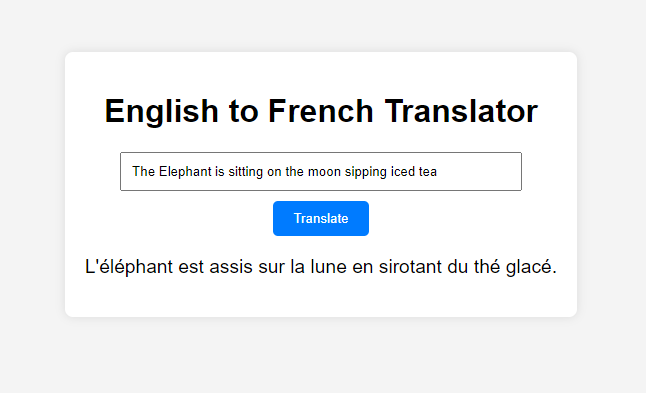

# A simple English to French translator using the Cohere API showcasing the multi language capabilities of the Cohere command-r-plus model

## Setup
1. Install all python dependencies

```
pip install cohere flask
```
2. Create a `.api_key` file with your Cohere API Key

3. Run the flask app using:

```
python app.py
```

## Screenshot

